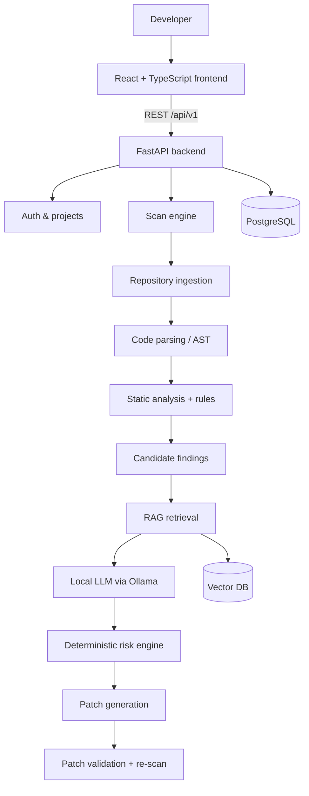

# SentinelForge

**AI-powered DevSecOps platform for vulnerability detection, risk analysis, explanation, automated repair and patch validation.**

> Status: **Phase 5 — Static analysis** complete (foundation, accounts, projects, code ingestion, vulnerability detection).
> Scanning, AI analysis, RAG, patching and validation are **not implemented yet**; they are
> planned in later phases (see [Roadmap](#roadmap)). Nothing in the UI is simulated.

## Problem statement

Static analysis tools find many potential vulnerabilities but produce false positives and
little guidance. LLMs can explain and fix code but hallucinate and cannot be trusted alone.
SentinelForge combines deterministic analysis (static analysis, AST/program analysis, rules),
retrieved security knowledge (CWE/OWASP) and local LLM reasoning, then **re-validates every
generated patch** before it is considered a fix.

Guiding principle: **do not trust the LLM alone.**

## Architecture (target)



Design: a **modular monolith** (one FastAPI service with clearly separated modules), built
phase by phase. Details: [docs/architecture/overview.md](docs/architecture/overview.md).

## What works today (Phases 1–3)

| Area | Implemented |
| --- | --- |
| Backend | FastAPI app factory, typed settings, structured JSON logging, request IDs, standard error envelope, CORS, security headers |
| Health | `GET /api/v1/health/live` (process) and `GET /api/v1/health` (PostgreSQL check, 503 when down) |
| Auth | Register / login / refresh / logout / me, scrypt password hashing, JWT access tokens, rotating httpOnly refresh cookies with reuse detection, CSRF protection, per-IP rate limiting, USER/ADMIN roles, audit log |
| Projects | Create / list / search / update / delete your own projects; another user's project is invisible, not merely forbidden |
| Database | PostgreSQL, SQLAlchemy 2.x, Alembic migrations: `users`, `refresh_sessions`, `audit_logs`, `projects` |
| Frontend | React 19 + TypeScript + React Router, sign-in / sign-up, session restore after reload, project list / create / detail / delete, admin account list, live **System status** page |
| Quality | 82 backend tests (pytest, incl. PostgreSQL integration), 29 frontend unit tests (Vitest), Ruff, ESLint |

Security design and its trade-offs: [docs/security/authentication.md](docs/security/authentication.md).

## Technology stack

Python 3.13 · FastAPI · Pydantic Settings · SQLAlchemy 2 · Alembic · PostgreSQL · psycopg 3 ·
PyJWT · React 19 · TypeScript · Vite · pytest · Vitest · Ruff · ESLint.
Planned: Ollama, ChromaDB/FAISS, Semgrep/SonarQube adapters, Docker Compose, GitHub Actions.

## Quick start (Windows / PowerShell)

Prerequisites: Python 3.13, Node.js 20+ (22 LTS recommended), PostgreSQL 16+.

### 1. Database

```sql
-- in psql or pgAdmin, as the postgres superuser
CREATE DATABASE sentinelforge;
CREATE DATABASE sentinelforge_test;
```

### 2. Backend

```powershell
cd backend
python -m venv venv
.\venv\Scripts\Activate.ps1
pip install -r requirements-dev.txt
copy .env.example .env          # then edit DATABASE_URL, TEST_DATABASE_URL and JWT_SECRET
python -c "import secrets; print(secrets.token_urlsafe(48))"   # value for JWT_SECRET
python -m alembic upgrade head  # apply migrations
python -m uvicorn app.main:app --reload
```

API: <http://localhost:8000> · Swagger UI: <http://localhost:8000/docs>

### 3. Frontend

```powershell
cd frontend
copy .env.example .env
npm install
npm run dev
```

UI: <http://localhost:5173>

### 4. Tests and checks

```powershell
# backend (from backend/, venv active)
python -m pytest
python -m ruff check .
python -m ruff format --check .

# frontend (from frontend/)
npm run lint
npm run test
npm run build
```

Or run everything at once: `.\scripts\verify.ps1` (from the repository root).

## Environment variables

Backend: [`backend/.env.example`](backend/.env.example) · Frontend: [`frontend/.env.example`](frontend/.env.example).
`.env` files are git-ignored and must never be committed.

## Database migrations

```powershell
# after changing a model in backend/app/models/
python -m alembic revision --autogenerate -m "describe change"
# REVIEW the generated file in alembic/versions/ before applying
python -m alembic upgrade head
python -m alembic check          # confirms models and database are in sync
```

## Project structure

```
SentinelForge/
├── backend/
│   ├── app/
│   │   ├── api/v1/        HTTP endpoints (thin) + router aggregation
│   │   ├── core/          config, database, logging, middleware, errors, deps
│   │   ├── models/        SQLAlchemy ORM models (+ mixins)
│   │   ├── repositories/  database queries (no business logic)
│   │   ├── schemas/       Pydantic request/response models
│   │   ├── services/      business logic (auth, health)
│   │   └── main.py        application factory
│   ├── alembic/           migrations
│   ├── scripts/           helper scripts (create test database)
│   └── tests/             unit / api / integration tests
├── frontend/              React + TypeScript app (see frontend/README.md)
├── docs/                  architecture, API conventions, development, phase reports
└── scripts/verify.ps1     run all checks on Windows
```

## Roadmap

| Phase | Milestone | Status |
| --- | --- | --- |
| 1 | Foundation | ✅ Done |
| 2 | Authentication (JWT, roles) | ✅ Done |
| 3 | Projects & ownership | ✅ Done |
| 4 | Repository ingestion & language detection | ✅ Done |
| 5 | Analysis engine (AST rules, patterns, secret detection) | ✅ Done |
| 6 | Scan orchestration & background jobs | Planned |
| 7 | RAG (security knowledge) | Planned |
| 8 | Local LLM (Ollama) analysis & explanation | Planned |
| 9 | Risk engine | Planned |
| 10–11 | Patch generation & validation | Planned |
| 12–13 | Dashboard & reports | Planned |
| 14–16 | DevSecOps integration, VS Code, research evaluation | Planned |

## Limitations (current)

- Analysis is rule-based and local: there is no data-flow (taint) tracking yet, so a finding says "this call is dangerous", not "user input reaches it".
- "No findings" means these rules did not match — it is not a certificate of security, and the UI says so.
- Analysis runs on request and synchronously; scheduled and background scans arrive in Phase 6.
- Ingestion and analysis are synchronous, so a very large repository ties up a request until the limits stop it.
- Only `.zip` archives and public `https://` Git URLs are accepted; private repositories need credentials (a later phase).
- No password reset, email verification or two-factor authentication.
- Rate-limit counters live in one process (Redis planned when workers multiply).
- No Docker setup yet (planned once more services exist).

## Documentation

- [Architecture overview](docs/architecture/overview.md)
- [API conventions](docs/api/conventions.md)
- [Development setup](docs/development/setup.md)
- [Security: authentication model](docs/security/authentication.md)
- [Security: ingesting untrusted code](docs/security/ingestion.md)
- [Security: analysing untrusted code](docs/security/analysis.md)
- [Phase 1 report](docs/development/phases/phase-01-foundation.md)
- [Phase 2 report](docs/development/phases/phase-02-authentication.md)
- [Phase 3 report](docs/development/phases/phase-03-projects.md)
- [Phase 4 report](docs/development/phases/phase-04-ingestion.md)
- [Phase 5 report](docs/development/phases/phase-05-analysis.md)
