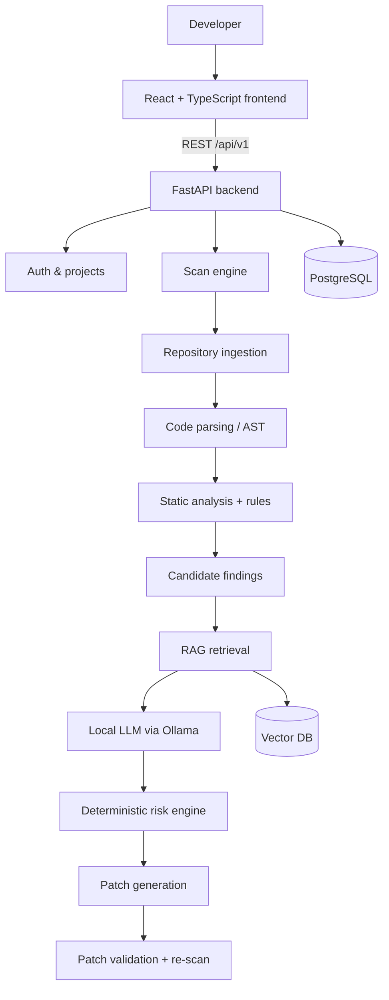

# SentinelForge

**AI-powered DevSecOps platform for vulnerability detection, risk analysis, explanation, automated repair and patch validation.**

> Status: **Phase 1 — Foundation** (backend + frontend skeleton, database, health, conventions).
> Scanning, AI analysis, RAG, patching and validation are **not implemented yet**; they are
> planned in later phases (see [Roadmap](#roadmap)). Nothing in the UI is simulated.

## Problem statement

Static analysis tools find many potential vulnerabilities but produce false positives and
little guidance. LLMs can explain and fix code but hallucinate and cannot be trusted alone.
SentinelForge combines deterministic analysis (static analysis, AST/program analysis, rules),
retrieved security knowledge (CWE/OWASP) and local LLM reasoning, then **re-validates every
generated patch** before it is considered a fix.

Guiding principle: **do not trust the LLM alone.**

## Architecture (target)



Design: a **modular monolith** (one FastAPI service with clearly separated modules), built
phase by phase. Details: [docs/architecture/overview.md](docs/architecture/overview.md).

## What works today (Phase 1)

| Area | Implemented |
| --- | --- |
| Backend | FastAPI app factory, typed settings, structured JSON logging, request IDs, standard error envelope, CORS, security headers |
| Health | `GET /api/v1/health/live` (process) and `GET /api/v1/health` (PostgreSQL check, 503 when down) |
| Database | PostgreSQL, SQLAlchemy 2.x, Alembic migrations, `users` table with timezone-aware timestamps |
| Frontend | React 19 + TypeScript, typed API client, live **System status** page with loading / error / retry states |
| Quality | 31 backend tests (pytest, incl. migration tests on real PostgreSQL), 18 frontend unit tests (Vitest), Ruff, ESLint |

## Technology stack

Python 3.13 · FastAPI · Pydantic Settings · SQLAlchemy 2 · Alembic · PostgreSQL · psycopg 3 ·
React 19 · TypeScript · Vite · pytest · Vitest · Ruff · ESLint.
Planned: JWT auth, Ollama, ChromaDB/FAISS, Semgrep/SonarQube adapters, Docker Compose, GitHub Actions.

## Quick start (Windows / PowerShell)

Prerequisites: Python 3.13, Node.js 20+ (22 LTS recommended), PostgreSQL 16+.

### 1. Database

```sql
-- in psql or pgAdmin, as the postgres superuser
CREATE DATABASE sentinelforge;
CREATE DATABASE sentinelforge_test;
```

### 2. Backend

```powershell
cd backend
python -m venv venv
.\venv\Scripts\Activate.ps1
pip install -r requirements-dev.txt
copy .env.example .env          # then edit DATABASE_URL and TEST_DATABASE_URL
python -m alembic upgrade head  # apply migrations
python -m uvicorn app.main:app --reload
```

API: <http://localhost:8000> · Swagger UI: <http://localhost:8000/docs>

### 3. Frontend

```powershell
cd frontend
copy .env.example .env
npm install
npm run dev
```

UI: <http://localhost:5173>

### 4. Tests and checks

```powershell
# backend (from backend/, venv active)
python -m pytest
python -m ruff check .
python -m ruff format --check .

# frontend (from frontend/)
npm run lint
npm run test
npm run build
```

Or run everything at once: `.\scripts\verify.ps1` (from the repository root).

## Environment variables

Backend: [`backend/.env.example`](backend/.env.example) · Frontend: [`frontend/.env.example`](frontend/.env.example).
`.env` files are git-ignored and must never be committed.

## Database migrations

```powershell
# after changing a model in backend/app/models/
python -m alembic revision --autogenerate -m "describe change"
# REVIEW the generated file in alembic/versions/ before applying
python -m alembic upgrade head
python -m alembic check          # confirms models and database are in sync
```

## Project structure

```
SentinelForge/
├── backend/
│   ├── app/
│   │   ├── api/v1/        HTTP endpoints (thin) + router aggregation
│   │   ├── core/          config, database, logging, middleware, errors, deps
│   │   ├── models/        SQLAlchemy ORM models (+ mixins)
│   │   ├── schemas/       Pydantic request/response models
│   │   ├── services/      business logic
│   │   └── main.py        application factory
│   ├── alembic/           migrations
│   ├── scripts/           helper scripts (create test database)
│   └── tests/             unit / api / integration tests
├── frontend/              React + TypeScript app (see frontend/README.md)
├── docs/                  architecture, API conventions, development, phase reports
└── scripts/verify.ps1     run all checks on Windows
```

## Roadmap

| Phase | Milestone | Status |
| --- | --- | --- |
| 1 | Foundation | ✅ Implemented, awaiting review |
| 2 | Authentication (JWT, roles) | Planned |
| 3 | Projects & ownership | Planned |
| 4 | Repository ingestion & language detection | Planned |
| 5 | Analysis engine (rules, AST, static analyzer adapters) | Planned |
| 6 | Scan orchestration & background jobs | Planned |
| 7 | RAG (security knowledge) | Planned |
| 8 | Local LLM (Ollama) analysis & explanation | Planned |
| 9 | Risk engine | Planned |
| 10–11 | Patch generation & validation | Planned |
| 12–13 | Dashboard & reports | Planned |
| 14–16 | DevSecOps integration, VS Code, research evaluation | Planned |

## Limitations (current)

- No authentication yet: do not expose the API outside localhost.
- No vulnerability analysis exists yet — Phase 1 is infrastructure only.
- No Docker setup yet (planned once more services exist).

## Documentation

- [Architecture overview](docs/architecture/overview.md)
- [API conventions](docs/api/conventions.md)
- [Development setup](docs/development/setup.md)
- [Phase 1 report](docs/development/phases/phase-01-foundation.md)
