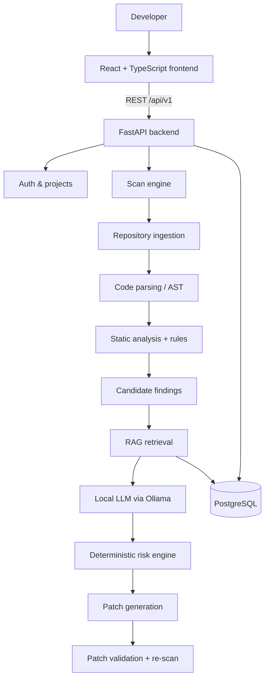

# SentinelForge

**AI-powered DevSecOps platform for vulnerability detection, risk analysis, explanation, automated repair and patch validation.**

> Status: **Phase 15 — VS Code extension** complete (foundation, accounts, projects,
> ingestion, detection, background scans with history, locally-indexed CWE/OWASP knowledge,
> per-finding explanations from a local model with every citation verified, a deterministic
> risk score that shows its working, proposed fixes as reviewable diffs, a re-scan of every
> proposal on a throwaway copy, a dashboard, reports as HTML, Markdown, SARIF or JSON, a
> command-line scanner with a quality gate for build pipelines, a GitHub Actions workflow,
> Docker Compose packaging, and a VS Code extension that shows findings in the editor).
> A proposed fix is still a **suggestion**: nothing is applied to your files. "Checked by
> re-scan" means the finding is no longer detected, nothing new is, and the change is not a
> deletion — not that the program still behaves the same. Nothing in the UI is simulated.

## Problem statement

Static analysis tools find many potential vulnerabilities but produce false positives and
little guidance. LLMs can explain and fix code but hallucinate and cannot be trusted alone.
SentinelForge combines deterministic analysis (static analysis, AST/program analysis, rules),
retrieved security knowledge (CWE/OWASP) and local LLM reasoning, then **re-validates every
generated patch** before it is considered a fix.

Guiding principle: **do not trust the LLM alone.**

## Architecture (target)


```mermaid
flowchart TD
    Dev[Developer] --> FE[React + TypeScript frontend]
    FE -->|REST /api/v1| API[FastAPI backend]
    API --> Auth[Auth & projects]
    API --> Scan[Scan engine]
    Scan --> Ingest[Repository ingestion] --> Parse[Code parsing / AST]
    Parse --> Static[Static analysis + rules] --> Cand[Candidate findings]
    Cand --> RAG[RAG retrieval] --> LLM[Local LLM via Ollama]
    LLM --> Risk[Deterministic risk engine] --> Patch[Patch generation]
    Patch --> Validate[Patch validation + re-scan]
    API --> PG[(PostgreSQL)]
    RAG --> PG
```

Design: a **modular monolith** (one FastAPI service with clearly separated modules), built
phase by phase. Details: [docs/architecture/overview.md](docs/architecture/overview.md).

## What works today (Phases 1–3)

| Area | Implemented |
| --- | --- |
| Backend | FastAPI app factory, typed settings, structured JSON logging, request IDs, standard error envelope, CORS, security headers |
| Health | `GET /api/v1/health/live` (process) and `GET /api/v1/health` (PostgreSQL check, 503 when down) |
| Auth | Register / login / refresh / logout / me, scrypt password hashing, JWT access tokens, rotating httpOnly refresh cookies with reuse detection, CSRF protection, per-IP rate limiting, USER/ADMIN roles, audit log |
| Projects | Create / list / search / update / delete your own projects; another user's project is invisible, not merely forbidden |
| Database | PostgreSQL, SQLAlchemy 2.x, Alembic migrations: `users`, `refresh_sessions`, `audit_logs`, `projects` |
| Frontend | React 19 + TypeScript + React Router, sign-in / sign-up, session restore after reload, project list / create / detail / delete, admin account list, live **System status** page |
| Quality | 82 backend tests (pytest, incl. PostgreSQL integration), 29 frontend unit tests (Vitest), Ruff, ESLint |

Security design and its trade-offs: [docs/security/authentication.md](docs/security/authentication.md).

## Technology stack

Python 3.13 · FastAPI · Pydantic Settings · SQLAlchemy 2 · Alembic · PostgreSQL · psycopg 3 ·
PyJWT · React 19 · TypeScript · Vite · pytest · Vitest · Ruff · ESLint.
Planned: Ollama, ChromaDB/FAISS, Semgrep/SonarQube adapters, Docker Compose, GitHub Actions.

## Quick start (Windows / PowerShell)

Prerequisites: Python 3.13, Node.js 20+ (22 LTS recommended), PostgreSQL 16+.

### 1. Database

```sql
-- in psql or pgAdmin, as the postgres superuser
CREATE DATABASE sentinelforge;
CREATE DATABASE sentinelforge_test;
```

### 2. Backend

```powershell
cd backend
python -m venv venv
.\venv\Scripts\Activate.ps1
pip install -r requirements-dev.txt
copy .env.example .env          # then edit DATABASE_URL, TEST_DATABASE_URL and JWT_SECRET
python -c "import secrets; print(secrets.token_urlsafe(48))"   # value for JWT_SECRET
python -m alembic upgrade head  # apply migrations
python -m uvicorn app.main:app --reload
```

API: <http://localhost:8000> · Swagger UI: <http://localhost:8000/docs>

### 3. Frontend

```powershell
cd frontend
copy .env.example .env
npm install
npm run dev
```

UI: <http://localhost:5173>

### 4. Tests and checks

```powershell
# backend (from backend/, venv active)
python -m pytest
python -m ruff check .
python -m ruff format --check .

# frontend (from frontend/)
npm run lint
npm run test
npm run build
```

Or run everything at once: `.\scripts\verify.ps1` (from the repository root).

## Environment variables

Backend: [`backend/.env.example`](backend/.env.example) · Frontend: [`frontend/.env.example`](frontend/.env.example).
`.env` files are git-ignored and must never be committed.

## Database migrations

```powershell
# after changing a model in backend/app/models/
python -m alembic revision --autogenerate -m "describe change"
# REVIEW the generated file in alembic/versions/ before applying
python -m alembic upgrade head
python -m alembic check          # confirms models and database are in sync
```

## Project structure

```
SentinelForge/
├── backend/
│   ├── app/
│   │   ├── api/v1/        HTTP endpoints (thin) + router aggregation
│   │   ├── core/          config, database, logging, middleware, errors, deps
│   │   ├── models/        SQLAlchemy ORM models (+ mixins)
│   │   ├── repositories/  database queries (no business logic)
│   │   ├── schemas/       Pydantic request/response models
│   │   ├── services/      business logic (auth, health)
│   │   └── main.py        application factory
│   ├── alembic/           migrations
│   ├── scripts/           helper scripts (create test database)
│   └── tests/             unit / api / integration tests
├── frontend/              React + TypeScript app (see frontend/README.md)
├── docs/                  architecture, API conventions, development, phase reports
└── scripts/verify.ps1     run all checks on Windows
```

## In a build pipeline

The scanner also runs from a terminal, with no database, no account and no
configuration. It reads a folder, executes nothing in it, and exits 0, 1 or 2.

```bash
cd backend
python -m app.cli scan ../path/to/code                       # fail on HIGH or worse
python -m app.cli scan . --sarif out.sarif                   # also write SARIF
python -m app.cli scan . --baseline out.sarif                # fail only on what is new
```

See [the command-line scanner](docs/devsecops/command-line.md). The workflow in
`.github/workflows/ci.yml` runs it on every push and pull request.

## How good is it?

Measured, not asserted. `python -m app.cli evaluate` marks the analyser against
a benchmark whose answers are published, and the results — including the
categories it fails — are recorded in [docs/evaluation](docs/evaluation/README.md).
`.\scripts\evaluate.ps1` downloads the two benchmarks and checks that the
recorded results can be reproduced.

## In VS Code

The extension in `vscode-extension/` runs the same scanner and puts each finding
on its line, in the Problems panel and in the status bar. Open that folder in
VS Code and press `F5`, or see [its README](vscode-extension/README.md).

## With Docker

```bash
cp docker.env.example .env      # then fill in the two values it asks for
docker compose up --build       # http://localhost:5173
```

See [running with Docker](docs/devsecops/docker.md).

## Roadmap

| Phase | Milestone | Status |
| --- | --- | --- |
| 1 | Foundation | ✅ Done |
| 2 | Authentication (JWT, roles) | ✅ Done |
| 3 | Projects & ownership | ✅ Done |
| 4 | Repository ingestion & language detection | ✅ Done |
| 5 | Analysis engine (AST rules, patterns, secret detection) | ✅ Done |
| 6 | Scan orchestration & background jobs | ✅ Done |
| 7 | RAG (security knowledge) | ✅ Done |
| 8 | Local LLM (Ollama) analysis & explanation | ✅ Done |
| 9 | Risk engine | ✅ Done |
| 10 | Patch generation (proposed diffs) | ✅ Done |
| 11 | Patch validation (apply to a copy, re-scan) | ✅ Done |
| 12 | Dashboard across projects | ✅ Done |
| 13 | Reports (HTML, Markdown, SARIF, JSON) | ✅ Done |
| 14 | DevSecOps integration (command-line scanner, quality gate, CI workflow, Docker Compose) | ✅ Done |
| 15 | VS Code extension | ✅ Done |
| 16 | Research evaluation (benchmark with known answers, data flow for Python, patch-outcome classifier) | ✅ Done |

## Limitations (current)

- Request data is followed to the call it reaches **for Python only, and inside one file**. For Java, JavaScript, PHP and Go the rules are still local: a finding says "this call is dangerous", not "user input reaches it".
- Measured on the OWASP benchmarks, on test cases the rules were never tuned on, the analyser scores **+88 out of 100 for Python and +33 for Java** (recall minus false positive rate, averaged over categories). Java has no rule at all for five of the benchmark's eleven categories, and its SQL-injection rule cannot tell an injectable query from a safe one. These are results on generated test cases, not on real projects; see [the evaluation](docs/evaluation/README.md) for what they do and do not show.
- The patch-outcome classifier has a training pipeline and **no result**: it needs fixes that were proposed and checked on a real installation, and refuses to train on fewer than 60. The application does not use it to decide anything.
- "No findings" means these rules did not match — it is not a certificate of security, and the UI says so.
- Scans run in the background on the API machine. Workers on other machines, and scheduled scans, are not built yet.
- The knowledge base has to be built once, by hand (`python scripts/build_knowledge.py`), from a
  downloaded CWE catalogue. Until then, findings are listed without reference material and the UI
  says why rather than showing an empty panel.
- Retrieval is exact brute-force similarity over a few thousand passages. That is fast at this
  size and would need a real index (pgvector, or an ANN library) at a hundred times it.
- A proposed fix is **written by a language model and has not been run**. It is not applied to
  your files, it does not change the finding, and it does not lower the risk score. Read it
  before you use it.
- "Checked by re-scan" is a narrow claim: on a throwaway copy the finding is no longer
  detected, nothing new is, and the change is not a deletion. It is **not** a claim that the
  program still behaves the same — the project's own tests are never run, because they are
  code somebody uploaded.
- A re-scan is only as good as the rules it re-runs. A change that rewrites a weakness into a
  form no rule recognises would pass validation. Two such gaps were found and closed while building this phase — SQL built with `.format()`
  on a literal, and a secret hidden behind a shell default — and others certainly remain.
- No fix is proposed for a hard-coded credential. It has to be rotated; editing the line does
  not un-leak it, and a diff would have to print it.
- The patched file is parsed only for Python. For other languages a syntactically broken
  change is not caught by a parser, and the check is reported as *not checked* rather than
  passed.
- Explanations are generated by a local model and are **generated text, not a verdict**. The
  finding, its severity and its status come from the analyser and are never revisited by the
  model. Citations are checked against the passages the model was actually given; invented ones
  are dropped and counted on screen.
- A generation takes 20-60s on a CPU, so it is a background job requested per finding rather
  than something that runs during a scan.
- Ollama and a pulled model are optional. Without them, scanning, findings and the knowledge
  base all work, and asking for an explanation fails with the command that fixes it.
- The risk score is a **policy, not a measurement**: its constants encode defensible opinions
  rather than anything derived from incident data, they live in one reviewable file
  (`app/risk/policy.py`), and every score is shown with the arithmetic that produced it. It is
  not CVSS and does not map onto CVSS.
- Risk does not account for reachability. For Python the analyser now knows when request data
  reaches a call, but the score does not use that yet: it still uses the file path as a heuristic
  and says so.
- The dashboard counts what is in the database when it is opened. It reads every finding you
  own on each request and scores them in memory, which is exact and fast for thousands of
  findings and would need to become SQL aggregation, or a cache, for hundreds of thousands. It
  has no date filter, and its only trend is each repository's score per scan.
- A report is written from the last completed scan and is not stored: asking again after a new
  scan gives a different document. There is no PDF export — the HTML report is built to be
  printed, and a browser's "Save as PDF" is the PDF. Reports contain no model output.
- The SARIF output follows the 2.1.0 structure and is covered by tests of that structure, but it
  has not been validated against the official schema file or uploaded to GitHub code scanning
  yet. That is the first job of the CI phase.
- The quality gate judges by severity, by risk score, or against a baseline. It has no
  per-finding suppression ("ignore this one line"): the only ways to leave something out are a
  path exclusion, which is printed in every run, and a baseline.
- The Docker images and the GitHub Actions workflow were written and checked as far as they can
  be without running them — the compose file is validated and the scan step was run exactly as
  written on a clean copy — but **no image was built and no workflow run happened** before
  they were committed. Their first real run is the test.
- The VS Code extension scans on request or on save, not as you type, and it underlines whole
  lines. It is run from its folder (`F5`) rather than installed: packaging it as a `.vsix` has
  not been done.
- Ingestion is still synchronous, so a very large upload ties up a request until the limits stop it. Scanning is not.
- Only `.zip` archives and public `https://` Git URLs are accepted; private repositories need credentials (a later phase).
- No password reset, email verification or two-factor authentication.
- Rate-limit counters live in one process (Redis planned when workers multiply).
- No Docker setup yet (planned once more services exist).

## Documentation

- [Architecture overview](docs/architecture/overview.md)
- [API conventions](docs/api/conventions.md)
- [Development setup](docs/development/setup.md)
- [Security: authentication model](docs/security/authentication.md)
- [Security: ingesting untrusted code](docs/security/ingestion.md)
- [Security: analysing untrusted code](docs/security/analysis.md)
- [Security: the knowledge base](docs/security/knowledge.md)
- [Security: the local model](docs/security/llm.md)
- [Security: proposed fixes](docs/security/patching.md)
- [Security: validating a fix](docs/security/validation.md)
- [Security: reports](docs/security/reports.md)
- [The command-line scanner and the quality gate](docs/devsecops/command-line.md)
- [Running with Docker](docs/devsecops/docker.md)
- [The VS Code extension](vscode-extension/README.md)
- [Evaluation: how often is the analyser right?](docs/evaluation/README.md)
- [Evaluation: the patch-outcome classifier](docs/evaluation/classifier.md)
- [Phase 1 report](docs/development/phases/phase-01-foundation.md)
- [Phase 2 report](docs/development/phases/phase-02-authentication.md)
- [Phase 3 report](docs/development/phases/phase-03-projects.md)
- [Phase 4 report](docs/development/phases/phase-04-ingestion.md)
- [Phase 5 report](docs/development/phases/phase-05-analysis.md)
- [Phase 6 report](docs/development/phases/phase-06-scans.md)
- [Phase 7 report](docs/development/phases/phase-07-knowledge.md)
- [Phase 8 report](docs/development/phases/phase-08-llm.md)
- [Phase 9 report](docs/development/phases/phase-09-risk.md)
- [Phase 10 report](docs/development/phases/phase-10-patches.md)
- [Phase 11 report](docs/development/phases/phase-11-validation.md)
- [Phase 12 report](docs/development/phases/phase-12-dashboard.md)
- [Phase 13 report](docs/development/phases/phase-13-reports.md)
- [Phase 14 report](docs/development/phases/phase-14-devsecops.md)
- [Phase 15 report](docs/development/phases/phase-15-vscode.md)
- [Phase 16 report](docs/development/phases/phase-16-evaluation.md)
