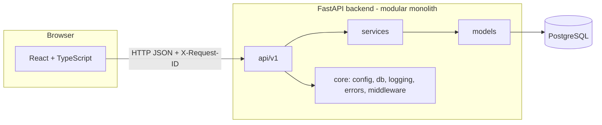
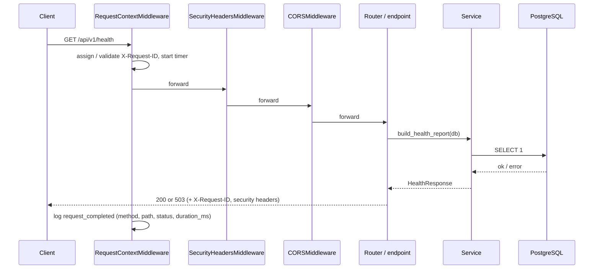

# Architecture overview

## Style: modular monolith

SentinelForge runs as **one FastAPI backend** plus **one React frontend**, backed by PostgreSQL.
Inside the backend, each concern lives in its own package with a single responsibility.
Separate services (workers, AI service) are introduced only when a real need appears
(e.g. long scans in Phase 6), not for buzzwords.



## Backend layers

| Layer | Package | Responsibility | Must NOT |
| --- | --- | --- | --- |
| API | `app/api/v1` | HTTP: routing, status codes, dependency injection | contain business logic or SQL |
| Schemas | `app/schemas` | Pydantic request/response contracts | import ORM models |
| Services | `app/services` | Business logic, orchestration | know about HTTP objects |
| Repositories | `app/repositories` | Database queries | decide policy |
| Models | `app/models` | ORM tables and relationships | contain business logic |
| Core | `app/core` | Config, DB engine/session, logging, errors, middleware, deps | depend on features |

Later phases add `analysis/`, `ai/`, `rag/`, `risk/`, `patching/`, `jobs/`, `integrations/`
as sibling packages using the same rules.

## Request lifecycle (Phase 1)



Errors raised anywhere are converted by `app/core/errors.py` into the standard envelope
(see [API conventions](../api/conventions.md)).

## Configuration

`app/core/config.py` defines a typed `Settings` class. Values come from environment variables,
then `backend/.env`. The path to `.env` is resolved from the file location, so the app,
Alembic and pytest behave the same from any working directory. Invalid configuration
(e.g. non-PostgreSQL URL, wildcard CORS) fails at startup instead of at runtime.

## Database

- PostgreSQL is the system of record; schema changes only via Alembic.
- `Base.metadata` has a **naming convention** so constraints get predictable names
  (`pk_users`, `ix_users_email`, later `fk_…`, `uq_…`), which Alembic needs to alter them safely.
- Timestamps are `TIMESTAMPTZ`, generated by the database (`now()`), via `TimestampMixin`.

## Frontend layers

```
pages  →  hooks  →  services  →  apiClient  →  fetch
  ↓
components (presentational only)
```

- `apiClient` is the only place that performs HTTP. It adds timeouts, parses the error
  envelope into `ApiError { code, message, status, requestId }`, and distinguishes
  network failures, timeouts and invalid responses.
- Services validate response shape at runtime (never trust the network).
- Every screen handles loading, success, error and retry.

## Ingestion

Untrusted source code enters the system in `app/ingestion/`, and the rule for
every module there is that **code is data, never something to run**:

```
upload / git URL  →  limits + validation  →  isolated workspace  →  file summary
                     (archive.py, git_clone.py)   (workspace.py)     (language.py)
```

- One directory per repository under `WORKSPACE_ROOT`; the database stores a
  *relative* path, so the root stays deployment configuration.
- Nothing from an archive or repository is executed: no build, no hooks, no
  submodules, and every extracted file lands as `0644` data.
- Limits (size, expansion ratio, file count, per-file size, clone timeout) are
  settings, so a deployment can tighten them without a code change.

## Current vs planned components

| Component | Status |
| --- | --- |
| FastAPI app, config, logging, errors, health | Implemented (Phase 1) |
| PostgreSQL + Alembic, `users` table | Implemented (Phase 1) |
| React + TS shell, system status page | Implemented (Phase 1) |
| Authentication, sessions, roles, audit log | Implemented (Phase 2) — see [security/authentication.md](../security/authentication.md) |
| Projects with per-user ownership | Implemented (Phase 3) |
| Repositories, ingestion (zip upload, git clone, language detection) | Implemented (Phase 4) — see [security/ingestion.md](../security/ingestion.md) |
| Analysis engine, scan orchestration | Phases 5–6 |
| RAG, Ollama LLM, risk engine | Phases 7–9 |
| Patch generation & validation | Phases 10–11 |
| Dashboard, reports, CI/CD, VS Code, evaluation | Phases 12–16 |
