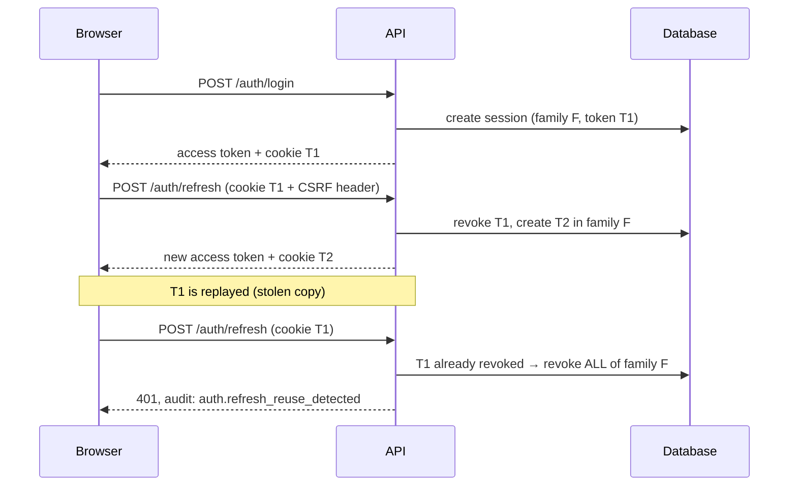

# Authentication and session security

How SentinelForge authenticates users, and *why* each choice was made. Phase 2.

## Threats considered

| Threat | Mitigation |
| --- | --- |
| Password database leak | scrypt hashes with per-user salt; cost parameters stored with each hash so they can be raised later |
| Brute-force login | Per-IP sliding-window rate limit (429 + `Retry-After`), deliberately slow hashing |
| User enumeration | Identical response for unknown user and wrong password; a dummy hash is verified so both take the same time; registration conflicts do not say which field clashed |
| Token theft from browser storage | Access token lives in a JavaScript variable only; nothing is written to `localStorage`/`sessionStorage` |
| Refresh token theft via XSS | Refresh token is an httpOnly cookie, unreadable from JavaScript |
| Refresh token replay | Rotation on every refresh; replay of a used token revokes the entire session family |
| CSRF on cookie endpoints | Double-submit token: readable `sf_csrf` cookie must be echoed in `X-CSRF-Token` |
| Forged / downgraded tokens | HS256 only (algorithm allow-list, `alg: none` rejected), issuer and audience checked, signature verified |
| Stale authorisation | The token carries a role, but every request re-loads the user; deactivating an account invalidates existing tokens immediately |
| Database leak revealing sessions | Only SHA-256 hashes of refresh tokens are stored |

## Password storage

```
scrypt$n=32768,r=8,p=2$<salt>$<hash>
```

- `hashlib.scrypt` (Python standard library, OpenSSL under the hood). scrypt is
  memory-hard: attacking it needs ~64 MiB per guess, which makes GPU cracking
  expensive. OWASP lists it directly after Argon2id.
- Cost is configurable (`SCRYPT_N/R/P`) and recorded inside every hash, so a
  future increase does not invalidate existing accounts: `needs_rehash()` spots
  weak hashes and login transparently upgrades them.
- Verification uses `hmac.compare_digest` (constant time).
- Passwords are capped at 1024 bytes so a huge request body cannot exhaust memory.

**Trade-off:** the specification mentioned Argon2id. Argon2 needs the compiled
`argon2-cffi` package; scrypt ships with Python, so the project has one fewer
dependency and every hashing path is testable in CI. The hashing functions take
the algorithm parameters from settings, so swapping in Argon2 later touches one
module (`app/core/security.py`), not the login flow.

## Tokens

| | Access token | Refresh token |
| --- | --- | --- |
| Format | JWT (HS256) | 32 random bytes, opaque |
| Lifetime | 15 minutes (`ACCESS_TOKEN_TTL_MINUTES`) | 14 days (`REFRESH_TOKEN_TTL_DAYS`) |
| Sent as | `Authorization: Bearer …` | httpOnly cookie `sf_refresh`, path `/api/v1/auth` |
| Stored by the browser | in memory only | cookie jar (not reachable from JS) |
| Stored by the server | nothing | SHA-256 hash in `refresh_sessions` |
| Revocable | no (short life) | yes, immediately |

Claims: `sub`, `role`, `iss`, `aud`, `iat`, `exp`, `jti`. `decode_access_token`
requires `exp`, `iat`, `sub`, `jti` and verifies issuer and audience.

The role inside the token is a hint only. `get_current_user` loads the user
from the database on every request, so a disabled account or a changed role
takes effect at once rather than after 15 minutes.

## Session rotation and reuse detection



The legitimate user is signed out too — deliberately: one of the two parties
holding that token is an attacker, and signing in again is cheap.

## CSRF

The refresh cookie is sent automatically by the browser, so another site could
trigger `/auth/refresh`. That site cannot read our cookies (same-origin policy),
so we require the value of the readable `sf_csrf` cookie in the `X-CSRF-Token`
header. Missing or mismatched → `403 CSRF_TOKEN_INVALID`.

The CORS configuration must allow that header, and cookies only travel
cross-origin when `allow_credentials` is on with explicit origins (never `*`).

## Roles

`USER` and `ADMIN`, stored as a PostgreSQL enum. **The first account created
becomes the admin**, which bootstraps a fresh installation without a default
password. Endpoints declare what they need:

```python
def list_users(_admin: AdminUser, db: DbSession) -> UserListResponse: ...
```

## Audit trail

Every security-relevant action writes one row to `audit_logs`: action, user,
IP, user agent, request ID and JSON details — never passwords or tokens. Rows
survive user deletion (`ON DELETE SET NULL`) because the record of what
happened must outlive the account.

Actions today: `user.registered`, `auth.login_succeeded`, `auth.login_failed`,
`auth.token_refreshed`, `auth.refresh_reuse_detected`, `auth.logout`.

## Known limitations (Phase 2)

- Rate-limit counters live in one process; with several workers each gets its
  own window, and a restart clears them. Redis fixes this when needed.
- No password reset, no email verification, no two-factor authentication.
- No lock-out or alerting after repeated failures beyond the rate limit.
- `X-Forwarded-For` is not trusted, so behind a reverse proxy the audit log
  records the proxy's IP until that is configured deliberately.
- Access tokens cannot be revoked before they expire (15 minutes); disabling
  the account blocks them immediately because the user is re-loaded per request.
